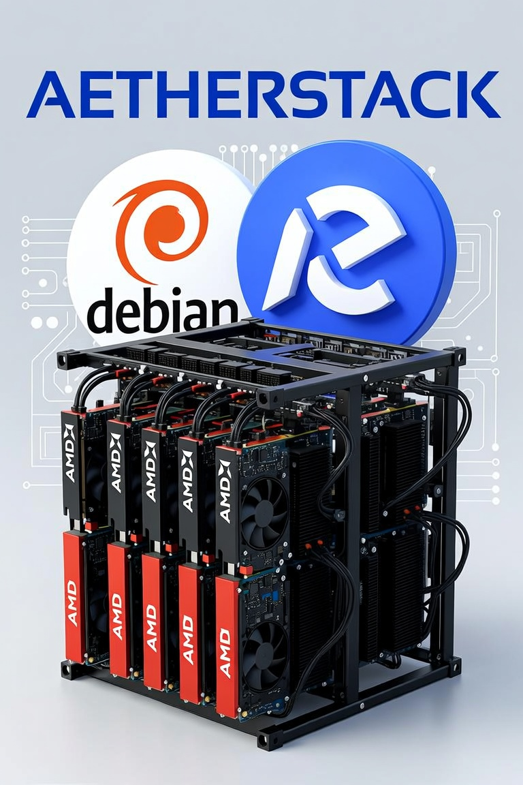

# AetherStack

**One setup. One chat window. Many models underneath.**

AetherStack is a **local multi-model control plane** for developers: you configure policy once, then work in **VS Code or Open WebUI as if you had a single assistant** — while research, critique, coding, and testing can run across **local GPU models and cloud providers** under your rules.

| | |
|---|---|
| **Repo** | [github.com/piksliviksi/aetherstack](https://github.com/piksliviksi/aetherstack) |
| **VS Code** | [Marketplace · AetherStack](https://marketplace.visualstudio.com/items?itemName=AetherStack.aetherstack) |
| **Platforms** | Windows 11 · macOS (Intel / Apple Silicon) · Ubuntu/Linux |

---

## What you get

| Benefit | In practice |
|---------|-------------|
| **One surface** | Stay in VS Code or the browser chat — no hopping Claude / Grok / ChatGPT apps for normal work |
| **One façade** | Clients see one base URL, one API key, one model id |
| **Flexible engine** | Combos, pipelines, and a node canvas route work by role, tier, and cost |
| **Spend discipline** | Token saver, tier caps, and `/done` → `/clear` so context does not grow forever |
| **Memory that lasts** | Decisions archived when you clear; optional **multi-project** pull of already-tested concepts |
| **Your hardware** | Local inference on Metal / ROCm CUs / CUDA via host Ollama; Docker holds the control plane |
| **Shareable setups** | Export/import combos, pipelines, and graphs like config, not tribal knowledge |

### How the workflow changes

| Before | With AetherStack |
|--------|------------------|
| Pick a product per task | One chat; policy chooses models |
| Re-paste context between tools | Shared memory + optional cross-project index |
| “Which model for this?” every time | Combos / pipelines / node graph you set once |
| Context windows bloat | Finish unit of work → archive → clear |
| IDE vs cloud vs local all separate | Same gateway for IDE, WebUI, and scripts |

**Day-to-day:** start the stack → open the project → talk to Aether → when a task is done, `/done` then `/clear` or `/compact`. Next message starts clean; memory keeps the important bits.

Full operating model: [docs/OPERATING-MODEL.md](./docs/OPERATING-MODEL.md)

---

## Start in one step

| OS | Start | Stop | Tutorial |
|----|--------|------|----------|
| **Windows** | Double-click `start.bat` | `stop.bat` | [TUTORIAL-WINDOWS](./docs/TUTORIAL-WINDOWS.md) |
| **macOS** | `./start.sh` | `./stop.sh` | [TUTORIAL-MACOS](./docs/TUTORIAL-MACOS.md) |
| **Ubuntu/Linux** | `./start.sh` | `./stop.sh` | [TUTORIAL-UBUNTU](./docs/TUTORIAL-UBUNTU.md) |

**Need:** [Docker](https://docs.docker.com/get-docker/) · host [Ollama](https://ollama.com) recommended for GPU · copy `.env.example` → `.env` for cloud keys.

| Open | URL |
|------|-----|
| Chat | http://localhost:3000 |
| Gateway (IDE) | http://localhost:4000/v1 |
| Operator hub | http://localhost:8766 |

Setup details, keys, and IDE wiring: [docs/QUICKSTART.md](./docs/QUICKSTART.md)

---

## Services (what runs)

| Service | Port | You use it for |
|---------|------|----------------|
| **Open WebUI** | 3000 | Browser chat (same “one window” idea) |
| **LiteLLM** | 4000 | Single OpenAI-compatible gateway for all models |
| **Aether Hub** | 8766 | Discover, routes, combos, pipelines, node graph, memory, slash |
| **Redis** | 6379 | Cache + shared agent memory |
| **Ollama** (host) | 11434 | Local GPU inference (Metal / ROCm / CUDA) |

---

## Documentation map

Technical depth lives under **`docs/`** and component folders — not in this README.

| I want to… | Go here |
|------------|---------|
| Understand the full operating model | [docs/OPERATING-MODEL.md](./docs/OPERATING-MODEL.md) |
| Install / first run / env / IDE | [docs/QUICKSTART.md](./docs/QUICKSTART.md) · platform tutorials |
| Use VS Code extension | [docs/VSCODE-EXTENSION.md](./docs/VSCODE-EXTENSION.md) |
| Combos, pipelines, node canvas | [combos/](./combos/) · [docs/PIPELINES.md](./docs/PIPELINES.md) · [docs/NODE-GRAPH.md](./docs/NODE-GRAPH.md) |
| Agent modes & token saver | [docs/AGENT-MODES.md](./docs/AGENT-MODES.md) |
| Memory & multi-project pull | [docs/AGENT-MEMORY.md](./docs/AGENT-MEMORY.md) · [docs/CROSS-MEMORY.md](./docs/CROSS-MEMORY.md) |
| Slash `/clear` hygiene | [docs/SLASH-COMMANDS.md](./docs/SLASH-COMMANDS.md) |
| Gateway model aliases | [docs/GATEWAY.md](./docs/GATEWAY.md) · [`litellm_config.yaml`](./litellm_config.yaml) |
| GPU (NVIDIA / AMD / Intel / Mac) | [docs/GPU-NVIDIA.md](./docs/GPU-NVIDIA.md) · [docs/AMD-COMPUTE.md](./docs/AMD-COMPUTE.md) · [docs/WSL-AMD-GPU.md](./docs/WSL-AMD-GPU.md) · [docs/GPU-INTEL.md](./docs/GPU-INTEL.md) |
| Capability matrix & routing | [docs/CAPABILITY-MATRIX.md](./docs/CAPABILITY-MATRIX.md) · [aether-hub/](./aether-hub/) |
| Project footprint engine | [project-engine/README.md](./project-engine/README.md) |
| Security | [docs/SECURITY-NOTES.md](./docs/SECURITY-NOTES.md) |
| All docs index | [docs/README.md](./docs/README.md) |

---

## License

MIT — see [LICENSE](./LICENSE).

Built on [Ollama](https://ollama.com), [Open WebUI](https://github.com/open-webui/open-webui), [LiteLLM](https://github.com/BerriAI/litellm), and Redis. Not affiliated with those projects.
